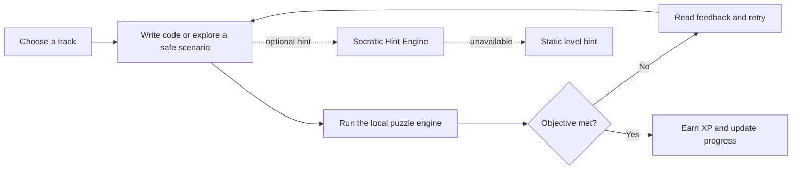

# Ngoding Lok — Complete Documentation

**Table of Contents:**
- [Features & Gameplay](#features--gameplay)
- [Technical Architecture](#technical-architecture)
- [Achievement & Leaderboard System](#achievement--leaderboard-system)
- [Streak System](#streak-system)
- [Code Golf Leaderboards](#code-golf-leaderboards)
- [Firebase Integration](#firebase-integration)
- [Performance Tracking](#performance-tracking)

---

## Features & Gameplay

### Core Learning Tracks

| Track | Missions | What learners do |
| --- | ---: | --- |
| **Python Track** | 9 | Navigate grids with sequential commands and sequence rocket-launch commands. |
| **SQL Track** | 5 | Query mock datasets with filtering, ordering, and aggregation challenges. |
| **Java Track** | 2 | Work through Java-labelled grid and stateful-launch learning patterns. |
| **Cybersecurity Track** | 5 | Explore closed, fictional labs covering service discovery, input handling, evidence-based choices, SOC response, and red/blue remediation. |

**21 playable missions** across 4 learning tracks with 4 interactive puzzle engines and 3 supported targets (web, Android, Windows).

### How a Mission Works



### Current Experience

| Area | What is available now |
| --- | --- |
| **Learn by doing** | An editable code editor, live console feedback, timers, and deterministic puzzle engines for grid movement, SQL, and ordered rocket commands. |
| **Expanded curriculum** | 21 launchable missions across Python, SQL, Java, and cybersecurity tracks. |
| **Safe security practice** | Five self-contained labs with scripted terminal, browser, and decision environments—no system commands, sockets, or real targets are used. |
| **Progression** | XP, best-score stars, daily streak display, leagues from Wood to Platinum, achievements, and Streak Freeze purchases. |
| **Player spaces** | Home hub, League Map, Code Golf boards, profile/achievement view, Friends and referral pages, certificates, settings, landing, sign-up, and password-recovery screens. |
| **Identity and continuity** | Firebase Google and GitHub sign-in where configured; the local session persists XP, completion, scores, badges, and cybersecurity progress on the device. |
| **Social and credentials** | Firestore-backed friend streams, reciprocal referral reconciliation, public certificate verification, and responsive PDF certificate downloads. |
| **Responsive UI** | A terminal-noir design with dark/light modes, adaptive mobile-to-desktop layouts, motion, and hover treatments. |

### Player Interface

**Home hub:** identity, level, XP, seeded streak, current league, a next-mission shortcut, and quick navigation.

**League Map:** Python, SQL, Java, and cybersecurity selectors; completed missions show a best score and star rating.

**Code Golf:** mock Global/Friends standings ranked by byte count or completion speed. A solution is only revealed after the learner has cleared its mission.

**Profile and settings:** achievements, a local streak calendar, XP-purchased Streak Freezes, live dark/light mode, sound preference, account/legal UI, and sign-out.

---

## Technical Architecture

### Core Layers

- **`core/curriculum/`** defines typed tracks, missions, and engine-specific configurations.
- **`core/interpreter/`** contains the pure grid, SQL, and rocket puzzle logic; malformed input produces feedback instead of crashing the UI.
- **`core/cybersecurity/`** parses authored JSON room definitions for the closed cybersecurity simulations.
- **`core/session/`** handles Firebase OAuth wrappers, local session persistence, XP scoring, leaderboards, hints, and app routes.
- **`core/social/`** derives achievements and supplies the mock Code Golf data.
- **`presentation/`** owns responsive screens, animations, themes, widgets, and per-screen timer/async state.

`RootOrchestrator` is the single application state owner. It coordinates the current route, active mission, ad/hint overlay, and `UserSession`; individual game screens own their timer and execution UI state.

### Tech Stack

| Layer | Technology |
| --- | --- |
| Client | Flutter and Dart (`^3.10.4`) |
| Platforms | Web, Android, Windows |
| Authentication | Firebase Core, Firebase Authentication, Google Sign-In, GitHub OAuth provider |
| Local persistence | `shared_preferences` |
| Hint service | Firebase Cloud Functions v2, TypeScript, Anthropic SDK, Zod |
| Networking | `http` |
| Credential export | `pdf`, `printing` |
| Quality checks | `flutter_test`, `flutter_lints`, GitHub Actions |

### Project Layout

```text
NgeCode-Juh/
├── .github/workflows/web-deploy.yml    CI: analyze, test, and build a web artifact
├── assets/
│   ├── localization/                   UI strings
│   ├── rooms/                          Authored, safe cybersecurity scenarios
│   └── templates/                      Level data
├── doc/
│   └── assets/banner.svg               README hero artwork
├── functions/
│   ├── src/index.ts                    generateSocraticHint HTTPS function
│   └── README.md                       Function emulator and deploy guide
├── lib/
│   ├── main.dart                       Firebase bootstrap and app root
│   ├── firebase_options.dart           Generated Firebase configuration
│   ├── core/
│   │   ├── curriculum/                 Tracks, modules, typed configurations
│   │   ├── cybersecurity/              Safe-room domain models
│   │   ├── interpreter/                Grid, SQL, and rocket engines
│   │   ├── session/                    Auth, session, hints, progression
│   │   └── social/                     Achievements and Code Golf data
│   └── presentation/
│       ├── screens/                    Landing, hub, maps, games, profile, settings
│       ├── theme/                      Terminal-noir and supporting visual systems
│       └── widgets/                    Editors, terminals, game chrome, landing UI
├── test/                               Unit and widget coverage
└── pubspec.yaml                        Flutter dependencies and asset registration
```

---

## Achievement & Leaderboard System

### 🎯 Achievement Categories

#### Module-Based
- **First Steps** - Complete any level
- **Sequential Steps** - Complete Module 1
- **Grid Master** - Complete a logic grid challenge
- **SQL Sleuth** - Complete a database query challenge
- **Rocket Scientist** - Complete an escape velocity challenge

#### Track-Based
- **Cyber Defender** - Complete a cybersecurity room
- **Java Starter** - Complete a Java track quest
- **The Polyglot Badge** - Complete all levels in a track

#### Progression
- **Module Runner** - Complete 3 curriculum modules (3/3)
- **Halfway There** - Complete half the curriculum (N/total)
- **Curriculum Complete** - Finish all modules

#### Streak-Based (Daily Login)
- **The Persistence Badge** - Hold 3-day coding streak
- **Week Warrior** - Hold 7-day coding streak
- **Streak Legend** - Hold 14-day coding streak

#### Performance
- **High Roller** - Earn 500+ XP
- **Efficiency Expert** - Score 90%+ on a module
- **Speedrunner** - Complete a quest in under 60 seconds

#### Code Golf (NEW!)
- **Code Golfer** - Submit a solution to the global board
- **Golf Enthusiast** - Complete 3 code golf modules
- **Golf Master** - Complete all code golf modules

**22+ Achievement Badges** total. All achievements unlock immediately when you complete a module.

### Key Achievement Classes

**`Achievement`** (lib/core/social/achievement.dart)
```dart
class Achievement {
  final String id;          // Unique identifier
  final String title;       // Display name
  final String description; // Player-facing text
  final bool unlocked;      // Is this achievement earned?
  final int progress;       // Current progress (0-target)
  final int target;         // Goal progress
}
```

**`Achievements.forUser()`** - Computes all achievements for a user from `UserSession`. Achievements are calculated fresh on every profile view from latest session data (no desync). Returns 22-25 Achievement instances.

### Data Flow: Achievement Unlock

```
1. User completes a module
2. recordModuleCompletion() called with module score
3. Firestore transaction starts
4. New achievements calculated: Achievements.forUser(updatedUser)
5. achievementIds list updated in transaction
6. Transaction commits (atomic)
7. Profile screen calls Achievements.forUser(user) again
8. New achievement now has unlocked: true
9. Badge appears in full color in grid
```

---

## Streak System

### How Streaks Work

1. **Day 1:** Log in → Streak = 1
2. **Day 2:** Log in same time next day → Streak = 2
3. **Miss a day:** Streak resets to 1 (unless you use a Freeze)
4. **Gap = 2 days exactly:** Freeze token saves your streak (+1)

### Tracking Data

- **Tracks:** Consecutive days you log in
- **Best Streak:** Your personal record (never decreases)
- **Calendar:** 4-week heatmap showing active days
- **lastActivityDate:** Stored as `yyyy-MM-dd` (timezone-aware, local midnight)

### Streak Freeze Token

- **Cost:** 200 XP
- **Effect:** Protects ONE missed day (prevents reset)
- **Buy:** Profile screen > "Streak Freeze" button
- **Display:** Shows how many you have saved

### Achievement Rewards

- 3-day → **The Persistence Badge**
- 7-day → **Week Warrior Badge**
- 14-day → **Streak Legend Badge** (Gold!)

### Implementation Details

**`UserSession.withActivity()`** - Recalculates streak based on gap from `lastActivityDate`:
- Same day: no change
- +1 day: increment streak
- +2 days with freeze: use freeze, keep streak
- Gap > 2 or no freeze: reset to 1

Best streak updates automatically if current streak exceeds it.

---

## Code Golf Leaderboards

### Three Ranking Modes

#### 1️⃣ **Bytes Mode** (Default)
> "Fewest bytes wins" - Traditional code golf

- Primary: Shortest solution (byte count)
- Tiebreaker 1: Fastest execution time
- Tiebreaker 2: Best accuracy score

#### 2️⃣ **Speedrun Mode** (NEW)
> "Who finished first?" - Race to completion

- Primary: Earliest completion timestamp (`completedAt`)
- Tiebreaker 1: Fastest execution speed
- Tiebreaker 2: Best accuracy score

#### 3️⃣ **Accuracy Mode** (NEW)
> "Highest accuracy" - Solution quality

- Primary: Highest score/accuracy (90%+)
- Tiebreaker 1: Shortest solution
- Tiebreaker 2: Fastest execution

### Scope Filters

- **Global** - See all submissions from all players worldwide
- **Friends** - See only submissions from your connected friends

### Track Filters

- **Python** - Python solutions
- **SQL** - Database queries
- **Java** - Java code solutions

### Example Leaderboard Entry

```
🥇 Rank 1 | 120 bytes | completed 2026-07-15 14:23 UTC
   👤 raynold's solution | 245ms execution | 95% accuracy
   ✨ Friend | [Show code if you've completed this module]

🥈 Rank 2 | 156 bytes | completed 2026-07-15 16:45 UTC
   👤 alex_codes | 312ms execution | 87% accuracy
```

### Sorting Logic Example

```dart
List<CodeGolfEntry> _sortEntries(List<CodeGolfEntry> entries) {
  return entries..sort((a, b) {
    if (_boardMode == 0) {  // Bytes
      if (a.bytes != b.bytes) return a.bytes.compareTo(b.bytes);
      if (a.executionMs != b.executionMs) 
        return a.executionMs.compareTo(b.executionMs);
      return b.accuracy.compareTo(a.accuracy);
    }
    else if (_boardMode == 1) {  // Speedrun
      final aTime = a.completedAt ?? DateTime(2099);
      final bTime = b.completedAt ?? DateTime(2099);
      if (aTime != bTime) return aTime.compareTo(bTime);
      if (a.executionMs != b.executionMs)
        return a.executionMs.compareTo(b.executionMs);
      return b.accuracy.compareTo(a.accuracy);
    }
    else {  // Accuracy
      if (a.accuracy != b.accuracy) 
        return b.accuracy.compareTo(a.accuracy);
      if (a.bytes != b.bytes) return a.bytes.compareTo(b.bytes);
      return a.executionMs.compareTo(b.executionMs);
    }
  });
}
```

---

## Firebase Integration

### Collections & Schema

#### `users` Collection
```json
{
  "email": "player@example.com",
  "xp": 1250,
  "completedModuleIds": ["m1", "m2", "m3"],
  "streak": 5,
  "bestStreak": 14,
  "lastActivityDate": "2026-07-18",
  "moduleScores": {
    "m1": 100,
    "m2": 95,
    "m3": 87
  },
  "modulePerformance": {
    "m1": {
      "score": 100,
      "linesUsed": 15,
      "executionMs": 245,
      "accuracy": 1.0,
      "attempts": 3,
      "firstCompletedAt": "2026-07-10T14:23:00Z",
      "lastCompletedAt": "2026-07-12T09:15:00Z"
    }
  },
  "achievementIds": ["first_steps", "persistence", "module_runner"],
  "streakFreezes": 2,
  "friendIds": ["uid2", "uid3"],
  "referralCode": "RAYNOLD123",
  "referredBy": null,
  "updatedAt": "2026-07-18T10:00:00Z"
}
```

#### `codeGolfEntries` Collection
```json
{
  "uid": "user123",
  "moduleId": "m5",
  "moduleTitle": "Python Loops",
  "track": "python",
  "bytes": 120,
  "source": "for i in range(10): print(i)",
  "executionMs": 245,
  "completionScore": 100,
  "accuracy": 0.95,
  "playerName": "alex_codes",
  "completedAt": "2026-07-15T14:23:45Z",
  "updatedAt": "2026-07-16T10:00:00Z"
}
```

### Key Repository Methods

**`recordModuleCompletion()`** - Atomic transaction:
1. Read current user doc
2. Check if this is first completion or improvement
3. Update: xp, completedModuleIds, moduleScores, modulePerformance
4. Recalculate: achievements (auto-unlock), streak
5. Write Code Golf entry (if code track)
6. Return updated UserSession

**`recordActivity()`** - Called on login:
1. Read lastActivityDate from Firestore
2. Calculate streak delta
3. Recalculate achievements
4. Return updated UserSession with fresh streak

**`streamUserFromFirestore()`** - Real-time listener on user document, emits UserSession whenever Firestore doc changes.

### Safety Guarantees

- **Atomic Transactions:** All user updates happen together (no partial states)
- **Best Score Tracking:** Prevents XP replay attacks
- **Timestamp Precision:** All times recorded to millisecond
- **Real-time Sync:** Firestore streams changes to all devices

---

## Performance Tracking

### Module Performance Data

Each module stores:
- `score`: Best score achieved
- `linesUsed`: Code length in the solution
- `executionMs`: Execution time
- `accuracy`: Score ratio (0.0-1.0)
- `attempts`: Total attempts
- `firstCompletedAt`: When first cleared
- `lastCompletedAt`: When last improved

This data powers:
- Achievement "Speedrunner" (60s completion time)
- Achievement "Efficiency Expert" (90%+ accuracy)
- Code Golf accuracy rankings
- Speedrun leaderboard sorting

### What's Tracked

- ✅ Module completion time (first completed, last improved)
- ✅ Code execution performance (lines of code, execution ms)
- ✅ Solution accuracy (score as % of max XP)
- ✅ Code Golf submissions (bytes, execution time, accuracy)
- ✅ Daily login activity (timezone-aware `yyyy-MM-dd`)
- ✅ Streak progression (consecutive days, best streak)

### Firestore Query Costs

- **recordModuleCompletion():** 2 reads + 2 writes = 4 document ops
- **streamCodeGolfEntries():** 1 read per listener + continuous sync
- **recordActivity():** 1 read + 1 write = 2 document ops
- **Estimated daily cost per active user:** 10-20 document operations

### Achievement Computation Cost

- **O(n)** where n = number of curriculum modules (~50)
- **Called:** Once per Profile screen open
- **Cost:** <10ms on most devices
- **Cacheable:** Yes, but invalidates on any module completion

---

## Terminal Noir Design System

### Colors Used
- **Primary Accent:** Orange #FF5C01 (ember)
- **Success:** Green #00D98E (signal)
- **Secondary:** Blue #00D0FF (circuit)
- **Gold:** #FFD700 & #FFFF00 (premium achievements)
- **Background:** Dark #0A0500 (noir)

### Typography
- **Labels:** Monospace, all-caps (achievement titles)
- **Values:** Bold sans-serif (scores, counts)
- **Body:** Regular sans-serif (descriptions)

### Components
- Hairline borders (1px)
- Small radius (4px)
- Smooth animations (150-200ms)
- Fire icon (🔥) for active streaks

---

**Last Updated:** 2026-07-18
