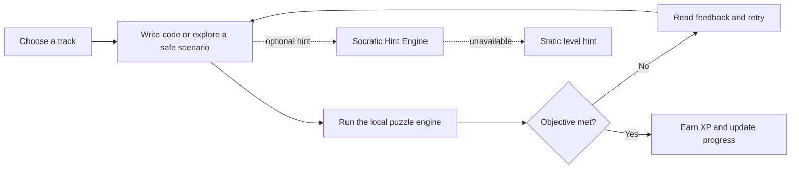
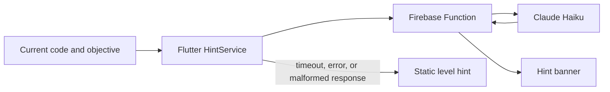

<p align="center">
  
</p>

<p align="center">
  <a href="https://ngoding-lok.web.app">
    
  </a>
  <a href="https://github.com/iamraaaey/Ngoding-Lok/actions/workflows/web-deploy.yml">
    
  </a>
  <a href="https://flutter.dev">
    
  </a>
  <a href="https://firebase.google.com/docs/auth">
    
  </a>
  <a href="https://www.anthropic.com">
    
  </a>
  <a href="#build-week-codex-and-gpt-56-collaboration">
    
  </a>
</p>

<p align="center">
  <strong>▶ Live web build:</strong> <a href="https://ngoding-lok.web.app">ngoding-lok.web.app</a>
  &nbsp;·&nbsp; <a href="https://ngoding-lok.web.app/privacy">Privacy policy</a>
</p>

<p align="center">
  <strong>Android:</strong> <a href="build/app/outputs/flutter-apk/app-release.apk">Download the latest APK</a>
</p>

<p align="center">
  <strong>A responsive, gamified learning arena for coding fundamentals and safe cybersecurity practice.</strong><br>
  Write code, inspect the outcome, earn XP, and get an optional nudge when you are stuck.
</p>

<p align="center">
  <a href="DOCUMENTATION.md">📚 Full Documentation</a> ·
  <a href="SETUP_AND_DEPLOYMENT.md">🚀 Setup & Deploy</a> ·
  <a href="#quick-start">Quick start</a> ·
  <a href="#curriculum">Curriculum</a> ·
  <a href="#build-week-codex-and-gpt-56-collaboration">Codex + GPT-5.6 use</a>
</p>

> **Naming note:** the user-facing application, the GitHub repository, and the Firebase project are branded **Ngoding Lok**. The Dart package and the Android application ID retain the original **NgeCode-Juh** / `com.ngecodejuh.ngecode_juh` identifiers.

---

<table>
  <tr>
    <td align="center"><strong>21</strong><br><sub>playable missions</sub></td>
    <td align="center"><strong>4</strong><br><sub>learning tracks</sub></td>
    <td align="center"><strong>4</strong><br><sub>interactive engines</sub></td>
    <td align="center"><strong>3</strong><br><sub>supported targets</sub></td>
  </tr>
</table>

## What is Ngoding Lok?

Ngoding Lok is a Flutter Final Year Project that turns beginner-friendly coding exercises into a progression-driven learning experience. It combines a responsive terminal-noir interface with editable code, visual or textual feedback, XP-based progression, achievements, and optional Socratic hints.

The app currently targets **web, Android, and Windows**. Its learning paths are grouped into Python, SQL, Java, and cybersecurity tracks on the League Map.

## AI-assisted build highlight

This submission explicitly used **Codex** and **GPT-5.6** as a build partner for product planning, code changes, debugging, responsive UI review, Firebase/social-flow fixes, and release checks. The detailed evidence trail, session IDs, and model-history note are collected in [Build Week: Codex and GPT-5.6 collaboration](#build-week-codex-and-gpt-56-collaboration).

## Current experience

| Area | What is available now |
| --- | --- |
| **Learn by doing** | An editable code editor, live console feedback, timers, and deterministic puzzle engines for grid movement, SQL, and ordered rocket commands. |
| **Expanded curriculum** | 21 launchable missions across Python, SQL, Java, and cybersecurity tracks. |
| **Safe security practice** | Five self-contained labs with scripted terminal, browser, and decision environments—no system commands, sockets, or real targets are used. |
| **Progression** | XP, best-score stars, daily streak display, leagues from Wood to Platinum, achievements, and Streak Freeze purchases. |
| **Player spaces** | Home hub, League Map, Code Golf boards, profile/achievement view, Friends and referral pages, certificates, settings, landing, sign-up, and password-recovery screens. |
| **Identity and continuity** | Firebase Google and GitHub sign-in where configured; the local session persists XP, completion, scores, badges, and cybersecurity progress on the device. |
| **Social and credentials** | Firestore-backed friend streams, reciprocal referral reconciliation, public certificate verification, and responsive PDF certificate downloads. |
| **Responsive UI** | A terminal-noir design with dark/light modes, adaptive mobile-to-desktop layouts, motion, and hover treatments. |

## Curriculum

| Track | Missions | What learners do |
| --- | ---: | --- |
| **Python Track** | 9 | Navigate grids with sequential commands and sequence rocket-launch commands. |
| **SQL Track** | 5 | Query mock datasets with filtering, ordering, and aggregation challenges. |
| **Java Track** | 2 | Work through Java-labelled grid and stateful-launch learning patterns. |
| **Cybersecurity Track** | 5 | Explore closed, fictional labs covering service discovery, input handling, evidence-based choices, SOC response, and red/blue remediation. |

Every listed mission is launchable in the current testing-oriented map. Finishing a mission records XP and the best efficiency score locally; cybersecurity rooms also retain their own progress and badges.

### Safe cybersecurity labs

The cybersecurity content is intentionally a **closed simulation**. The terminal only returns author-provided scripted responses, the browser is a local mockup, and decision rooms are fixed scenarios. Nothing in these labs executes a process, opens a socket, or connects to an external target.

## How a mission works



## Player progression and interface

The current flow starts with a terminal-style splash and landing page, then moves through authentication into the Home hub. From there, learners can resume the next incomplete mission across the ordered tracks or open the League Map, Code Golf, profile, and settings.

- **Home hub:** identity, level, XP, seeded streak, current league, a next-mission shortcut, and quick navigation.
- **League Map:** Python, SQL, Java, and cybersecurity selectors; completed missions show a best score and star rating.
- **Code Golf:** mock Global/Friends standings ranked by byte count. A solution is only revealed after the learner has cleared its mission.
- **Profile and settings:** achievements, a local streak calendar, XP-purchased Streak Freezes, live dark/light mode, sound preference, account/legal UI, and sign-out.

## Socratic hints

The three core code-game engines can request a contextual hint after a live rewarded-ad flow. Android and iOS use the native AdMob rewarded overlay; web uses the AdSense H5 Games Ad Placement API. If live ads are not configured or there is no fill, the request ends with an availability message and never renders a fake sponsor card. After the reward, the client sends the level objective and the learner’s current code to a Firebase HTTPS Function. The function asks Claude Haiku for one short, non-solution-revealing prompt and validates the structured response.



The client deliberately degrades gracefully: until a real endpoint is configured—or whenever a request fails—it shows the module’s authored static hint instead. The app remains usable without the backend.

## Architecture

The project keeps domain logic separate from UI orchestration:

- **`core/curriculum/`** defines typed tracks, missions, and engine-specific configurations.
- **`core/interpreter/`** contains the pure grid, SQL, and rocket puzzle logic; malformed input produces feedback instead of crashing the UI.
- **`core/cybersecurity/`** parses authored JSON room definitions for the closed cybersecurity simulations.
- **`core/session/`** handles Firebase OAuth wrappers, local session persistence, XP scoring, leaderboards, hints, and app routes.
- **`core/social/`** derives achievements and supplies the mock Code Golf data.
- **`presentation/`** owns responsive screens, animations, themes, widgets, and per-screen timer/async state.

`RootOrchestrator` is the single application state owner. It coordinates the current route, active mission, ad/hint overlay, and `UserSession`; individual game screens own their timer and execution UI state.

## Tech stack

| Layer | Technology |
| --- | --- |
| Client | Flutter and Dart (`^3.10.4`) |
| Platforms | Web, Android, Windows |
| Authentication | Firebase Core, Firebase Authentication, Google Sign-In, GitHub OAuth provider |
| Local persistence | `shared_preferences` |
| Hint service | Firebase Cloud Functions v2, TypeScript, Anthropic SDK, Zod |
| Networking | `http` |
| Credential export | `pdf`, `printing` |
| Quality checks | `flutter_test`, `flutter_lints`, GitHub Actions |

## Project layout

```text
NgeCode-Juh/
├── .github/workflows/web-deploy.yml    CI: analyze, test, and build a web artifact
├── assets/
│   ├── localization/                   UI strings
│   ├── rooms/                          Authored, safe cybersecurity scenarios
│   └── templates/                      Level data
├── doc/
│   └── assets/banner.svg               README hero artwork
├── functions/
│   ├── src/index.ts                    generateSocraticHint HTTPS function
│   └── README.md                       Function emulator and deploy guide
├── lib/
│   ├── main.dart                       Firebase bootstrap and app root
│   ├── firebase_options.dart           Generated Firebase configuration
│   ├── core/
│   │   ├── curriculum/                 Tracks, modules, typed configurations
│   │   ├── cybersecurity/              Safe-room domain models
│   │   ├── interpreter/                Grid, SQL, and rocket engines
│   │   ├── session/                    Auth, session, hints, progression
│   │   └── social/                     Achievements and Code Golf data
│   └── presentation/
│       ├── screens/                    Landing, hub, maps, games, profile, settings
│       ├── theme/                      Terminal-noir and supporting visual systems
│       └── widgets/                    Editors, terminals, game chrome, landing UI
├── test/                               Unit and widget coverage
└── pubspec.yaml                        Flutter dependencies and asset registration
```

## Documentation Index

- **[DOCUMENTATION.md](DOCUMENTATION.md)** — Complete feature, architecture, and system reference
- **[SETUP_AND_DEPLOYMENT.md](SETUP_AND_DEPLOYMENT.md)** — Setup, deployment, Firebase, ads, and configuration
- **[CONSOLIDATION_SUMMARY.md](CONSOLIDATION_SUMMARY.md)** — What was merged (reference only)

---

## Quick start

### Prerequisites

- [Flutter SDK](https://docs.flutter.dev/get-started/install) compatible with Dart `^3.10.4`
- A supported target: Chrome for web, Windows desktop, or an Android device/emulator

### Run the client

```bash
flutter pub get
flutter run -d chrome
```

Other available examples:

```bash
flutter run -d windows
flutter run -d android
```

The client can be explored immediately. When OAuth or AI hints are not configured, the applicable UI follows its local/static fallback instead of preventing play. Rewarded hints require configured live ad inventory; the app does not substitute a fake ad preview.

### Run quality checks

```bash
flutter analyze
flutter test
flutter build web --release
```

The CI workflow runs these same Flutter checks for pushes and pull requests, then uploads `build/web` as an artifact. It does **not** deploy web hosting or the Cloud Function.

### Production web build

```bash
flutter build web --release --no-wasm-dry-run --no-pub
```

The released web client is hosted at [ngoding-lok.web.app](https://ngoding-lok.web.app). Firebase Hosting and Firestore rules are deployed separately from the Flutter build; see [`DEPLOY.md`](DEPLOY.md) for the deployment checklist.

## Rewarded ad setup

Rewarded hints are configured for real ad providers only:

- **Web:** `web/index.html` contains the AdSense publisher ID and Ad Placement API bootstrap. A public, approved AdSense H5 Games domain and account approval are required before `adBreak()` can return a live rewarded placement. See [`DEPLOY.md`](DEPLOY.md) for the Firebase Hosting deployment loop.
- **Android/iOS:** development builds use Google’s official rewarded test units. Production builds must use the real AdMob application ID in [`AndroidManifest.xml`](android/app/src/main/AndroidManifest.xml) and the rewarded unit IDs supplied through build-time defines:

  ```powershell
  flutter build apk --release `
    --dart-define=ADMOB_LIVE_ADS=true `
    --dart-define=ADMOB_ANDROID_REWARDED_AD_UNIT_ID=ca-app-pub-YOUR_ID/YOUR_REWARDED_UNIT
  ```

AdMob rewarded videos are native full-screen SDK overlays, while AdSense controls web playback. No fake `SPONSOR MESSAGE` or local-preview card is used.

## Build Week: Codex and GPT-5.6 collaboration

Ngoding Lok was built iteratively with **Codex** and **GPT-5.6** during the Build Week submission period. The AI collaboration was used as a hands-on engineering loop: inspect the current app, choose a scoped improvement, implement it in the Flutter/Firebase codebase, run targeted validation, then review the result against the live product and judging requirements.

### What Codex and GPT-5.6 contributed

- **Planning and product focus:** Codex helped inspect the existing app, README, documentation, UI references, and Build Week requirements, then shaped the work into judge-visible improvements rather than loose polish.
- **Implementation:** GPT-5.6/Codex were used to modify the Flutter and Firebase code paths for Friends/referrals, Certificates, profile achievements, responsive screens, and public credential export.
- **Debugging:** The AI-assisted workflow diagnosed the one-sided referral issue and guided a Firestore transaction/reconciliation fix that links both accounts consistently while preserving existing friend IDs.
- **UX refinement:** Codex reviewed the terminal-noir interface across desktop and mobile widths, improving scanability and layout behavior for social and credential flows.
- **Validation:** The collaboration included Flutter analysis, targeted tests, release web-build checks, and final README/submission evidence review.

### Required evidence for the submission

The primary Codex build thread must be cited in Devpost’s `/feedback` field. Add the real value below before submitting; do not leave a placeholder:

```text
Primary /feedback Session ID: 019f7881-913b-7b91-9e51-266f05217d73

Supporting Build Week Session IDs:
- 019f7861-b7f0-7d81-93bc-e4f731b26b38
- 019f781c-91b0-7e51-9dfa-2f32d39bd0ba
- 019f7593-8912-7c13-b29a-16db92b48544
- 019f6981-51f4-7e20-8c7a-e92eb24167f0
- 019f742f-aeb9-73e3-a62f-19a43831feb4
```

The Devpost submission should also include the exact GPT-5.6 model-history evidence from that thread and describe which decisions or changes it supported. This README documents the contribution areas; the session ID and model-history details are the source-of-truth evidence.

## Build Week judge access

### Public project links

- Live demo: [https://ngoding-lok.web.app](https://ngoding-lok.web.app)
- Canonical repository: [https://github.com/iamraaaey/Ngoding-Lok](https://github.com/iamraaaey/Ngoding-Lok)

The canonical repository is currently private for judging. Grant read access to both `testing@devpost.com` and `build-week-event@openai.com` before submitting. If the repository is switched to public, these private collaborator invitations are no longer required.

### Judge test path

1. Open the live demo and select a learning track.
2. Complete a short interactive mission and confirm that feedback, XP and completion state respond.
3. Open Profile and check the responsive achievements layout at desktop and mobile widths.
4. Open Friends. For referral testing, use two non-personal test accounts and confirm that a successful referral appears in both users’ crews after refresh.
5. Open an earned Certificate, verify the public credential details, and use the PDF download action.

The product is free to access. If Firebase authentication is required for a flow, use a dedicated non-personal judge/test account rather than sharing a private personal account or password in the public repository.

## Firebase Authentication setup

Firebase is initialized by the app using the committed generated options. For a fork or a different Firebase project, generate/configure your own options before sharing a build.

1. In Firebase Authentication, enable and configure the **Google** and **GitHub** providers you intend to use.
2. Add your local and deployed domains to the providers’ allowed origins/redirect configuration.
3. For the committed Google web client configuration, add `http://localhost:5000` as an authorized JavaScript origin and use a fixed port:

   ```bash
   flutter run -d chrome --web-port=5000
   ```

4. In **Firebase Console → Authentication → Sign-in method**, enable
   **Email/Password** and **Phone** and save them. Email sign-in/sign-up,
   password reset, SMS phone linking, and SMS verification use Firebase Auth
   directly.
5. In **Authentication → Templates → Password reset**, customize the sender
   name and reset email if needed. Also customize **Email address verification**,
   **Email address change**, and **Multi-factor enrolment notification** when
   MFA is enabled. Keep `ngoding-lok.web.app` and your local development domain
   in the project's authorized domains.
6. Create a test email/password user in **Authentication → Users**. The app's
   email sign-up form now creates a Firebase email/password account and sends
   the verification message.
7. Add Firebase test phone numbers under the Phone provider settings. Test
   numbers avoid sending real SMS while still exercising the verification flow.
8. For SMS MFA, upgrade the project to **Identity Platform**, enable SMS MFA
   under **Authentication → Sign-in method → Advanced**, and configure
   Android SHA-256, iOS APNs, and an authorized web domain. MFA enrollment also
   requires a verified email address.
9. SMTP is not configured by Flutter code. Configure the sender/domain and
   custom SMTP settings in Firebase Authentication/Identity Platform, then
   publish the required DNS records. The app only calls Firebase Auth, which
   sends the configured templates.

Google, GitHub, and email/password flows return to the app through Firebase
Authentication. The password-recovery form sends a real Firebase reset email.
Settings contains Firebase-backed email verification, verified email change,
password change, SMS phone linking, and SMS MFA enrollment flows.

## Socratic Hint Backend

Deploy this function to enable live Claude-powered hints after the rewarded-ad
gate. It requires Node.js 20, the Firebase CLI, a Firebase project, and an
Anthropic API key.

```bash
cd functions
npm install

firebase login
firebase use --add
firebase functions:secrets:set ANTHROPIC_API_KEY
npm run deploy
```

After deployment, the app uses the `ngoding-lok` function URL from
[`lib/core/config/backend_config.dart`](lib/core/config/backend_config.dart).
For another Firebase project, pass
`--dart-define=HINT_ENDPOINT_URL=https://.../generateSocraticHint` at build
time. See [functions/README.md](functions/README.md) for the local emulator
command and request/response contract.

The function verifies the signed-in Firebase user's ID token before calling
Claude. Add production rate limiting and monitoring appropriate for your
deployment before opening the feature to a large audience.

## Current prototype boundaries

| Capability | Current behavior |
| --- | --- |
| Email account management | Firebase handles email sign-in/sign-up, verification, password reset, verified email change, and password change when the required providers are enabled. |
| Progress sync | XP, completions, scores, badges, freezes, and cyber-room progress are saved only in device-local `SharedPreferences`; there is no cross-device cloud sync. |
| Leaderboards and Code Golf | Deterministic mock data plus the local player; no live multiplayer service. |
| XP sync and ads | XP remains device-local; rewarded hints use native AdMob on mobile and AdSense H5 Games on web when configured, with no fake ad fallback. |
| AI hints | Optional Cloud Function with a static per-level fallback when unavailable. |
| Cybersecurity labs | Closed, fictional simulations for learning; no live systems are accessed. |

## Testing

The repository includes unit and widget coverage for the grid and rocket interpreters, SQL checker, state/session models, local persistence, leaderboard ordering, hint-client failure paths, OAuth soft failures, responsive landing layouts, and core navigation/sign-up flows.

Run the checks in [Run quality checks](#run-quality-checks) before submitting changes.

## Roadmap

- Add a real persistent backend for cross-device progress, live rankings, and Code Golf submissions.
- Add production account-management observability and test the Firebase email/SMS flows on each supported platform.
- Harden the hint endpoint with authenticated access, abuse controls, monitoring, and deployment configuration.
- Replace mock XP/social behaviors with production services only when the learning experience and privacy model are ready; complete ad-account approval and operational monitoring for live inventory.
- Continue expanding authored missions and accessibility testing across screen sizes and platforms.

## Project context

Ngoding Lok / NgeCode-Juh is a **Final Year Project** by **Raynold Anak Kabai** for the Bachelor of Software Engineering (Hons) programme at Universiti Malaysia Sarawak (UNIMAS). The project explores whether a lightweight, gamified, multi-paradigm learning platform with Socratic AI hints can improve learner engagement and problem-solving persistence.

## License

This project is currently unlicensed and is not intended for redistribution (`publish_to: none`). Please contact the author regarding reuse.
