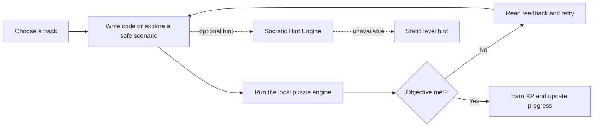
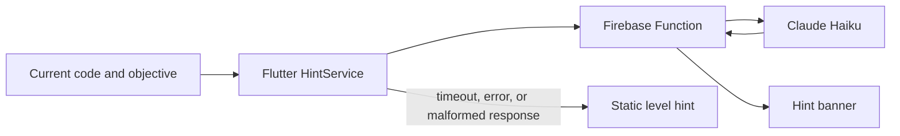

<p align="center">
  
</p>

<p align="center">
  <a href="https://github.com/iamraaaey/NgeCode-Juh/actions/workflows/web-deploy.yml">
    
  </a>
  <a href="https://flutter.dev">
    
  </a>
  <a href="https://firebase.google.com/docs/auth">
    
  </a>
  <a href="https://www.anthropic.com">
    
  </a>
</p>

<p align="center">
  <strong>A responsive, gamified learning arena for coding fundamentals and safe cybersecurity practice.</strong><br>
  Write code, inspect the outcome, earn XP, and get an optional nudge when you are stuck.
</p>

<p align="center">
  <a href="#quick-start">Quick start</a> ·
  <a href="#curriculum">Curriculum</a> ·
  <a href="#socratic-hints">AI hints</a> ·
  <a href="#current-prototype-boundaries">Prototype boundaries</a>
</p>

> **Naming note:** the user-facing application is branded **Ngoding Lok**. This repository and its Dart package retain the name **NgeCode-Juh**.

---

<table>
  <tr>
    <td align="center"><strong>21</strong><br><sub>playable missions</sub></td>
    <td align="center"><strong>3</strong><br><sub>learning tracks</sub></td>
    <td align="center"><strong>4</strong><br><sub>interactive engines</sub></td>
    <td align="center"><strong>3</strong><br><sub>supported targets</sub></td>
  </tr>
</table>

## What is Ngoding Lok?

Ngoding Lok is a Flutter Final Year Project that turns beginner-friendly coding exercises into a progression-driven learning experience. It combines a responsive terminal-noir interface with editable code, visual or textual feedback, XP-based progression, achievements, and optional Socratic hints.

The app currently targets **web, Android, and Windows**. Its default learning path is Python-labelled, with additional Java and cybersecurity tracks available from the League Map.

## Current experience

| Area | What is available now |
| --- | --- |
| **Learn by doing** | An editable code editor, live console feedback, timers, and deterministic puzzle engines for grid movement, SQL, and ordered rocket commands. |
| **Expanded curriculum** | 21 launchable missions across Python, Java, and cybersecurity tracks. |
| **Safe security practice** | Five self-contained labs with scripted terminal, browser, and decision environments—no system commands, sockets, or real targets are used. |
| **Progression** | XP, best-score stars, daily streak display, leagues from Wood to Platinum, achievements, and Streak Freeze purchases. |
| **Player spaces** | Home hub, League Map, Code Golf boards, profile/achievement view, settings, landing, sign-up, and password-recovery screens. |
| **Identity and continuity** | Firebase Google and GitHub sign-in where configured; the local session persists XP, completion, scores, badges, and cybersecurity progress on the device. |
| **Responsive UI** | A terminal-noir design with dark/light modes, adaptive mobile-to-desktop layouts, motion, and hover treatments. |

## Curriculum

| Track | Missions | What learners do |
| --- | ---: | --- |
| **Python Track** | 13 | Navigate grids with sequential commands, query mock datasets with SQL, and sequence rocket-launch commands. This is the default path used by “Resume Playing.” |
| **Java Track** | 3 | Work through Java-labelled versions of the same grid, SQL, and stateful-launch learning patterns. |
| **Cybersecurity Track** | 5 | Explore closed, fictional labs covering service discovery, input handling, evidence-based choices, SOC response, and red/blue remediation. |

Every listed mission is launchable in the current testing-oriented map. Finishing a mission records XP and the best efficiency score locally; cybersecurity rooms also retain their own progress and badges.

### Safe cybersecurity labs

The cybersecurity content is intentionally a **closed simulation**. The terminal only returns author-provided scripted responses, the browser is a local mockup, and decision rooms are fixed scenarios. Nothing in these labs executes a process, opens a socket, or connects to an external target.

## How a mission works



## Player progression and interface

The current flow starts with a terminal-style splash and landing page, then moves through authentication into the Home hub. From there, learners can resume the next Python-track mission or open the League Map, Code Golf, profile, and settings.

- **Home hub:** identity, level, XP, seeded streak, current league, a next-mission shortcut, and quick navigation.
- **League Map:** Python, Java, and cybersecurity selectors; completed missions show a best score and star rating.
- **Code Golf:** mock Global/Friends standings ranked by byte count. A solution is only revealed after the learner has cleared its mission.
- **Profile and settings:** achievements, a local streak calendar, XP-purchased Streak Freezes, live dark/light mode, sound preference, account/legal UI, and sign-out.

## Socratic hints

The three core code-game engines can request a contextual hint after the simulated rewarded-hint flow. The client sends the level objective and the learner’s current code to a Firebase HTTPS Function. The function asks Claude Haiku for one short, non-solution-revealing prompt and validates the structured response.



The client deliberately degrades gracefully: until a real endpoint is configured—or whenever a request fails—it shows the module’s authored static hint instead. The app remains usable without the backend.

## Architecture

The project keeps domain logic separate from UI orchestration:

- **`core/curriculum/`** defines typed tracks, missions, and engine-specific configurations.
- **`core/interpreter/`** contains the pure grid, SQL, and rocket puzzle logic; malformed input produces feedback instead of crashing the UI.
- **`core/cybersecurity/`** parses authored JSON room definitions for the closed cybersecurity simulations.
- **`core/session/`** handles Firebase OAuth wrappers, local session persistence, XP scoring, leaderboards, hints, and app routes.
- **`core/social/`** derives achievements and supplies the mock Code Golf data.
- **`presentation/`** owns responsive screens, animations, themes, widgets, and per-screen timer/async state.

`RootOrchestrator` is the single application state owner. It coordinates the current route, active mission, ad/hint overlay, and `UserSession`; individual game screens own their timer and execution UI state.

## Tech stack

| Layer | Technology |
| --- | --- |
| Client | Flutter and Dart (`^3.10.4`) |
| Platforms | Web, Android, Windows |
| Authentication | Firebase Core, Firebase Authentication, Google Sign-In, GitHub OAuth provider |
| Local persistence | `shared_preferences` |
| Hint service | Firebase Cloud Functions v2, TypeScript, Anthropic SDK, Zod |
| Networking | `http` |
| Quality checks | `flutter_test`, `flutter_lints`, GitHub Actions |

## Project layout

```text
NgeCode-Juh/
├── .github/workflows/web-deploy.yml    CI: analyze, test, and build a web artifact
├── assets/
│   ├── localization/                   UI strings
│   ├── rooms/                          Authored, safe cybersecurity scenarios
│   └── templates/                      Level data
├── doc/
│   └── assets/banner.svg               README hero artwork
├── functions/
│   ├── src/index.ts                    generateSocraticHint HTTPS function
│   └── README.md                       Function emulator and deploy guide
├── lib/
│   ├── main.dart                       Firebase bootstrap and app root
│   ├── firebase_options.dart           Generated Firebase configuration
│   ├── core/
│   │   ├── curriculum/                 Tracks, modules, typed configurations
│   │   ├── cybersecurity/              Safe-room domain models
│   │   ├── interpreter/                Grid, SQL, and rocket engines
│   │   ├── session/                    Auth, session, hints, progression
│   │   └── social/                     Achievements and Code Golf data
│   └── presentation/
│       ├── screens/                    Landing, hub, maps, games, profile, settings
│       ├── theme/                      Terminal-noir and supporting visual systems
│       └── widgets/                    Editors, terminals, game chrome, landing UI
├── test/                               Unit and widget coverage
└── pubspec.yaml                        Flutter dependencies and asset registration
```

## Quick start

### Prerequisites

- [Flutter SDK](https://docs.flutter.dev/get-started/install) compatible with Dart `^3.10.4`
- A supported target: Chrome for web, Windows desktop, or an Android device/emulator

### Run the client

```bash
flutter pub get
flutter run -d chrome
```

Other available examples:

```bash
flutter run -d windows
flutter run -d android
```

The client can be explored immediately. When OAuth or AI hints are not configured, the applicable UI follows its local/static fallback instead of preventing play.

### Run quality checks

```bash
flutter analyze
flutter test
flutter build web --release
```

The CI workflow runs these same Flutter checks for pushes and pull requests, then uploads `build/web` as an artifact. It does **not** deploy web hosting or the Cloud Function.

## Firebase OAuth setup

Firebase is initialized by the app using the committed generated options. For a fork or a different Firebase project, generate/configure your own options before sharing a build.

1. In Firebase Authentication, enable and configure the **Google** and **GitHub** providers you intend to use.
2. Add your local and deployed domains to the providers’ allowed origins/redirect configuration.
3. For the committed Google web client configuration, add `http://localhost:5000` as an authorized JavaScript origin and use a fixed port:

   ```bash
   flutter run -d chrome --web-port=5000
   ```

Google and GitHub flows return to the app through Firebase Authentication. The email sign-in/sign-up and password-recovery forms are intentionally local prototype flows; they do not create Firebase email/password accounts or send email.

## Optional Socratic Hint Backend

Deploy the function only when you want live Claude-powered hints. It requires Node.js 20, the Firebase CLI, a Firebase project, and an Anthropic API key.

```bash
cd functions
npm install

firebase login
firebase use --add
firebase functions:secrets:set ANTHROPIC_API_KEY
npm run deploy
```

After deployment, copy the printed function URL into [`lib/core/config/backend_config.dart`](lib/core/config/backend_config.dart). It starts as a `YOUR-PROJECT-ID` placeholder, so live hints are not enabled by default. See [functions/README.md](functions/README.md) for the local emulator command and request/response contract.

Before exposing the endpoint publicly, add the authentication, authorization, and rate-limiting controls appropriate for your deployment. The current prototype function accepts CORS-enabled POST requests and does not verify a Firebase Auth token.

## Current prototype boundaries

| Capability | Current behavior |
| --- | --- |
| Email account management | Form validation and confirmation UI only; no Firebase email/password account or reset-email backend. |
| Progress sync | XP, completions, scores, badges, freezes, and cyber-room progress are saved only in device-local `SharedPreferences`; there is no cross-device cloud sync. |
| Leaderboards and Code Golf | Deterministic mock data plus the local player; no live multiplayer service. |
| XP sync and ads | A local score calculator and simulated rewarded-hint/ad screen, not production services or an ad SDK. |
| AI hints | Optional Cloud Function with a static per-level fallback when unavailable. |
| Cybersecurity labs | Closed, fictional simulations for learning; no live systems are accessed. |

## Testing

The repository includes unit and widget coverage for the grid and rocket interpreters, SQL checker, state/session models, local persistence, leaderboard ordering, hint-client failure paths, OAuth soft failures, responsive landing layouts, and core navigation/sign-up flows.

Run the checks in [Run quality checks](#run-quality-checks) before submitting changes.

## Roadmap

- Add a real persistent backend for cross-device progress, live rankings, and Code Golf submissions.
- Implement Firebase-backed email/password account management and recovery.
- Harden the hint endpoint with authenticated access, abuse controls, monitoring, and deployment configuration.
- Replace mock XP/ad/social behaviors with production services only when the learning experience and privacy model are ready.
- Continue expanding authored missions and accessibility testing across screen sizes and platforms.

## Project context

Ngoding Lok / NgeCode-Juh is a **Final Year Project** by **Raynold Anak Kabai** for the Bachelor of Software Engineering (Hons) programme at Universiti Malaysia Sarawak (UNIMAS). The project explores whether a lightweight, gamified, multi-paradigm learning platform with Socratic AI hints can improve learner engagement and problem-solving persistence.

## License

This project is currently unlicensed and is not intended for redistribution (`publish_to: none`). Please contact the author regarding reuse.
