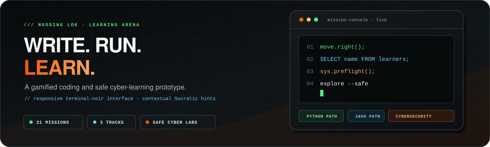

<p align="center">
  
</p>

# Ngoding Lok!

> An AI-assisted, gamified platform for teaching foundational programming concepts.

[](https://github.com/iamraaaey/Ngoding-Lok/actions/workflows/web-deploy.yml)
[](https://flutter.dev)
[](https://firebase.google.com/docs/functions)
[](https://www.anthropic.com/)

Ngoding Lok! is a cross-platform Flutter application that teaches programming
fundamentals through three distinct, playable puzzle modules — sequential grid
logic, SQL querying, and an ordered/stateful launch procedure — wrapped in a
game-like progression system (XP, a leaderboard, timed challenges, and module
completion tracking).

When a learner gets stuck, an **LLM-backed Socratic Hint Engine** analyzes
their *actual* in-progress code and replies with a short, indirect, guiding
hint — never the solution — and degrades gracefully to a static hint when the
backend is unavailable.

---

## Table of contents

- [Features](#features)
- [Learning modules](#learning-modules)
- [Socratic Hint Engine](#socratic-hint-engine)
- [Architecture](#architecture)
- [Tech stack](#tech-stack)
- [Project layout](#project-layout)
- [Getting started](#getting-started)
- [Backend setup (Socratic Hint Engine)](#backend-setup-socratic-hint-engine)
- [Testing](#testing)
- [Roadmap](#roadmap)
- [Project context](#project-context)
- [License](#license)

---

## Features

- **Three programming paradigms in one app** — grid movement, declarative SQL,
  and ordered launch commands, each with its own mini-language.
- **Reusable interpreter architecture** — every module runs on the same
  pure-function `Lexer → Parser → execution-step` contract, making each
  engine fully unit-testable without pumping a widget tree.
- **AI-generated, non-revealing hints** — a Firebase Cloud Function calls the
  Claude API under a constrained "tutor" prompt with schema-validated
  structured output.
- **Graceful degradation** — any backend/network failure falls back to the
  module's static hint text with no loss of functionality.
- **Gamification layer** — XP rewards, a leaderboard, per-module timers, and a
  hint-unlock flow (with simulated rewarded/interstitial ad placeholders).
- **Google Sign-In (web)** — real OAuth identity (name, email, avatar) on the
  auth screen, with a graceful fallback to the simulated email login when
  sign-in is cancelled or unavailable. Progress/XP remain in-memory.
- **Single codebase, multiple targets** — Web, Windows, and Android from one
  Flutter project.
- **CI on every push/PR** — GitHub Actions runs `analyze`, `test`, and a
  release web build.

---

## Learning modules

| # | Module | Paradigm | Learner writes | XP |
|---|--------|----------|----------------|----|
| 1 | **Sequential Steps** | Grid logic | `move.right(); move.down();` … to navigate a 2D grid to a target coordinate | 100 |
| 2 | **Intro to SQL** | Declarative querying | A single SQL query against a `users` table to satisfy the objective | 250 |
| 3 | **Aerospace Logic** | Ordered / stateful commands | A launch sequence — `sys.preflight(); engine.start(); throttle(N);` — where command *order* matters (igniting before preflight fails; throttling before ignition is a no-op) | 400 |

Modules are defined statically in
[lib/core/curriculum/curriculum.dart](lib/core/curriculum/curriculum.dart)
as a type-safe `CurriculumModule` list, each carrying a sealed-class
`ModuleConfig` (`LogicGridConfig` / `SqlTerminalConfig` / `RocketFlightConfig`).

---

## Socratic Hint Engine

The hint engine is deliberately *Socratic*: it identifies the single most
important flaw in the learner's code and returns one short, indirect hint —
phrased as a guiding question or observation, never as the fix.

```
Flutter client (HintService)
      │  POST { moduleType, levelObjective, currentCode }
      ▼
Firebase Cloud Function  (functions/src/index.ts — generateSocraticHint)
      │  constrained "tutor" system prompt + module DSL notes
      ▼
Anthropic Claude API  (schema-validated structured output)
      │  { hintTitle, hintMessage }
      ▼
HintBanner in the active game screen
```

- The API key lives only in the Cloud Function's secret store — never in the
  distributed client.
- [`HintService`](lib/core/session/hint_service.dart) **never throws**: any
  non-2xx, timeout, or malformed response resolves to `null`, and the calling
  screen falls back to the module's static hint text.

---

## Architecture

The client follows a layered, testability-first design:

- **`core/interpreter/`** — pure-function lexers/parsers per module, with no UI
  or timing dependencies. Given identical input, they always produce an
  identical execution-step queue, and they never throw on malformed input.
- **`core/state/`** — immutable state models (`GameState`, `RocketState`) using
  the `copyWith` pattern.
- **`core/curriculum/` · `core/session/`** — the module catalogue plus
  session, XP, leaderboard, and hint logic (plain immutable data / pure
  functions; no state-management package).
- **`presentation/screens/`** — `StatefulWidget` screens that own all
  mutable/timing/async orchestration.
- **`presentation/widgets/`** — stateless, purely-rendering widgets composed by
  the screens.

Navigation is handled by a single [`RootOrchestrator`](lib/presentation/screens/root_orchestrator.dart)
switching on an `AppRoute` enum (`auth` / `dashboard` / `game` / `ad`) rather
than `Navigator`-based routing.

📄 See [doc/architecture_spec.md](doc/architecture_spec.md) for the full
lexer/parser/state breakdown and the per-module interpreter contracts.

---

## Tech stack

| Layer | Technology |
|-------|------------|
| Client | Flutter · Dart (SDK `^3.10.4`) |
| Backend | Firebase Cloud Functions · Node.js · TypeScript |
| AI | Anthropic Claude API (schema-validated structured output via Zod) |
| Networking | `http` |
| Testing | `flutter_test` (unit + widget), mocked HTTP for backend-dependent code |
| CI/CD | GitHub Actions |

---

## Project layout

```
codequest-core/
├── .github/workflows/web-deploy.yml   CI: analyze, test, release web build
├── assets/
│   ├── localization/en.json           UI strings
│   └── templates/level_01.json        Level configuration map
├── doc/
│   ├── architecture_spec.md           Interpreter/state architecture
│   └── fyp_proposal.md                Final Year Project proposal
├── functions/                         Firebase Cloud Function (Socratic Hint Engine)
│   ├── src/index.ts                   generateSocraticHint
│   └── README.md                      Backend setup & deploy guide
├── lib/
│   ├── main.dart                      App entry point
│   ├── app_theme.dart                 Theme
│   ├── core/
│   │   ├── config/backend_config.dart Cloud Function endpoint URL
│   │   ├── curriculum/                Module catalogue + typed configs
│   │   ├── interpreter/               Per-module lexers & parsers
│   │   │   ├── lexer.dart · parser.dart          (grid logic)
│   │   │   ├── rocket_lexer.dart · rocket_parser.dart  (launch sequence)
│   │   │   └── sql_checker.dart                   (SQL, single-shot check)
│   │   ├── session/                   Auth session, hints, leaderboard, API
│   │   ├── state/                     Immutable GameState / RocketState
│   │   └── timer/game_timer_controller.dart
│   └── presentation/
│       ├── screens/                   Splash, auth, dashboard, game screens, ads
│       └── widgets/                   Code editor, canvas, header, hint banner, …
└── test/                              Unit & widget tests (interpreters, session, hints, …)
```

---

## Getting started

### Prerequisites

- [Flutter SDK](https://docs.flutter.dev/get-started/install) (Dart `^3.10.4`)
- A device/target: Chrome (web), Windows desktop, or an Android device/emulator

### Run the app

```bash
flutter pub get
flutter run -d chrome     # or: -d windows / -d android
```

The app runs fully client-side out of the box. Hints fall back to static text
until you deploy and configure the backend (below).

### Google Sign-In (web)

"Continue with Google" performs a real OAuth sign-in using the **public**
web client ID in
[lib/core/config/google_auth_config.dart](lib/core/config/google_auth_config.dart)
(client IDs are shipped to every browser by design; the client *secret* is
not used by this flow and is never committed).

1. In the [Google Cloud console](https://console.cloud.google.com/apis/credentials),
   open the OAuth **Web application** client and add your origins under
   **Authorized JavaScript origins** — e.g. `http://localhost:5000` for local
   development, plus your deployed URL.
2. Run on that fixed port:

   ```bash
   flutter run -d chrome --web-port=5000
   ```

If sign-in is cancelled or unavailable (e.g. Windows desktop, where the
plugin isn't supported), the email path still signs you into the simulated
session — nothing breaks.

---

## Backend setup (Socratic Hint Engine)

The AI hints require deploying the Cloud Function and pointing the client at it.

```bash
cd functions
npm install

firebase login
firebase use --add                              # select/create a Firebase project
firebase functions:secrets:set ANTHROPIC_API_KEY  # paste your Claude API key
npm run deploy
```

Then copy the printed HTTPS URL into
[`hintEndpointUrl`](lib/core/config/backend_config.dart).

Full instructions — including local emulator testing and the request/response
contract — are in [functions/README.md](functions/README.md).

---

## Testing

```bash
flutter analyze
flutter test
```

The suite covers the interpreter pipelines (grid, rocket, SQL), session/XP and
leaderboard logic, the hint-service client (including its failure/fallback
paths), and the primary navigation flow.

---

## Roadmap

Deferred as future work beyond the current scope (see
[the FYP proposal](doc/fyp_proposal.md)):

- **Dynamic Difficulty Adjustment** — procedural level generation tuned to
  learner performance.
- **Automated code-quality reviewer** — an AI pass that critiques *how* a
  solution is written, not just whether it passes.
- **Persistent accounts & storage** — replacing the current simulated
  auth/leaderboard layer with a real backend.
- **Real monetization** — integrating an ad SDK in place of the simulated
  rewarded/interstitial placeholders.

---

## Project context

Ngoding Lok! is developed as a **Final Year Project** by
**Raynold Anak Kabai**, Bachelor of Software Engineering (Hons),
Universiti Malaysia Sarawak (UNIMAS). The project investigates whether a
lightweight, gamified, multi-paradigm coding platform augmented with an
LLM-generated Socratic hint system can measurably improve learner engagement
and problem-solving persistence versus a static-hint baseline.

See [doc/fyp_proposal.md](doc/fyp_proposal.md) for the full proposal
(background, objectives, scope, methodology, and evaluation plan).

---

## License

This project is currently unlicensed and not intended for redistribution
(`publish_to: none`). Please contact the author regarding reuse.
